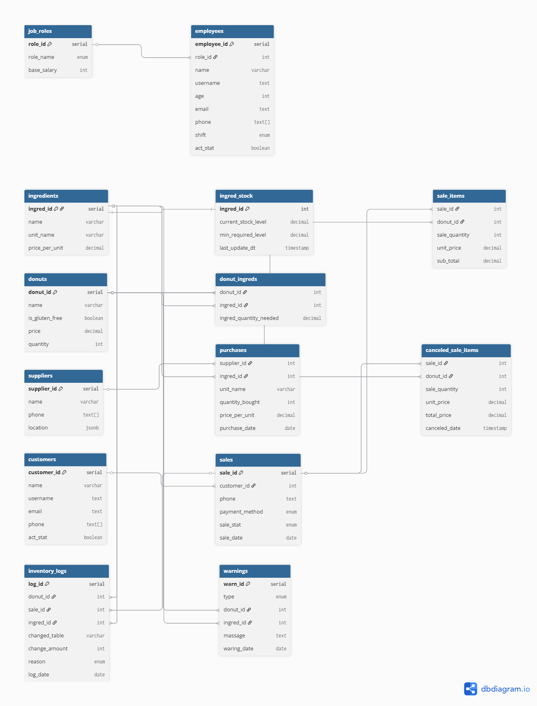

## Shop Management DBMS - PostgreSQL
Hello, this is a simple DBMS built in PostgreSQL.

This is a simple and fun project for testing my SQL skill and knowledge.
This project is a first step—it's the backend for a coming up Python CLI project.
This simple DBMS is fully relational; it's managed by PROCEDURES and TRIGGERS.
Procedures and triggers make this simple project more efficient and robust.

# Why procedure and triggers
Actually, when you try to use Python for insert/update operations, it takes many resources. It uses more RAM and memory as well. But procedures and triggers solve this effectively. For inserting and updating in tables, using procedures and triggers can be up to 100 times faster than doing it through Python.

# 📊 System Overview
The system consists of **14 tables**, **18 procedures**, and **5 triggers**.

# 🛠️ Core Modules:
Employee Management: Handles roles and staff data (job_roles, employees).
Inventory & Products: Manages ingredients, stock levels, and recipes (ingredients, ingred_stock, donut_ingreds, donuts).
Supply Chain: Tracks suppliers and raw material purchases (suppliers, purchases).
Sales & Logistics: Manages customer orders and cancellations (customers, sales, sale_items, canceled_sale_items).
Audit & Monitoring: Automated logs for every stock change and low-stock alerts (inventory_logs, warnings).

# 🔗 Relationships & Architecture:
The system follows a strict relational model. Key connections include:

Sales Flow: customers -> sales -> sale_items -> donuts.
Stock Flow: purchases -> ingred_stock -> donut_ingreds -> donuts.
Logging: All movements are linked to inventory_logs via sale_id, donut_id, or ingred_id.

### Database ER Diagram

You must read the design.txt file for a better understanding. Actually, all tables, procedures, and triggers have their short documentation there.

# About Me:
My name is Jisan.
I am a student of Data Science.
Currently, I am learning Math, Python, and SQL.
