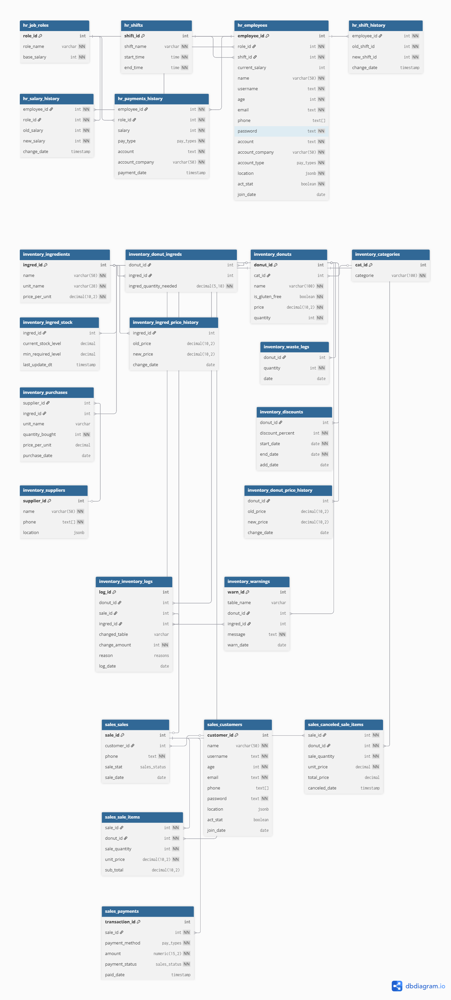

#### **Donut Shop Management System (Database Module)**
  A comprehensive, schema-based PostgreSQL database architecture designed for managing a donut business.\
  This system integrates inventory tracking, human resources, and sales management with high data integrity and automated business logic.

#### **📁 Folder Structure**

```donut_shop/
│
├── database/                # SQL source files
│   ├── schemas/             # Custom types and schema definitions
│   │   └── create_schemas.sql
│   ├── inventory/           # Inventory management (Tables, Procedures, Triggers)
│   ├── hr/                  # Employee and payroll management
│   ├── sales/               # Customer transactions and billing
│   └── tests.sql            # Test cases and dummy data
│
└── src/                     # Python source code (Coming Soon)
```

### 🏗 **Database Architecture**
The system is divided into three primary schemas to ensure modularity and security:
  
  * **Inventory**: Tracks ingredients, donuts, suppliers, and stock levels.
  * **HR**: Manages employee roles, shifts, and salary disbursements.
  * **Sales**: Handles customer data, order processing, payments and some views

#### **Key Stats**:
  * Tables: 25
  * Procedures: 32
  * Triggers: 9

#### **🚀 Key Features & Implementation Logic**
##### **1. Why Server-Side Logic (Procedures & Triggers)?**

  Instead of handling all logic via Python (Pandas/Polars), this project prioritizes Database-Level Logic for the following reasons:

  * **Data Integrity**: Triggers like ingred_stock_update ensure that inventory is updated automatically whenever a sale occurs, preventing human error or application-level bugs.

  * **Security**: Business rules (like price change logs or employee shift history) are enforced at the source, making it impossible to bypass them via external scripts.

  * **Performance**: By using stored procedures, we reduce the number of network trips between Python and the database, executing complex operations directly on the server. 


#### **2. Inventory Intelligence**
  * **Stock Warnings**: An automated warning system alerts when ingredient levels fall below the min_required_level.
  * **Price Tracking**: Comprehensive history tables for both ingredients and donuts to track inflation and pricing trends over time.
  * **Waste Logging**: Dedicated tracking for damaged or expired goods to ensure accurate financial reporting.


#### **3. Sales & Financial Integrity**
  * **Payment Validation**: The is_payment_complete procedure ensures no order is marked successful without full payment.

  * **Soft Deletion**: Customers and employees are never permanently deleted; instead, an act_stat flag is used to preserve historical data for future Data Science analysis.

  * **Automated Billing**: sale_items triggers calculate sub-totals and totals automatically upon insertion.


#### **4. Human Resource Management**
  * **Shift & Salary Tracking**: Automated logging of any changes in employee shifts or salary structures.
  * **Secure Access**: Procedures for credential verification with return codes for application-level handling.


### **📈 Future Data Science Goals**


The database is designed with Data Science in mind. The extensive logging (Price history, Waste logs, Sales trends) allows for:

  * Predictive inventory management using Python.
  * Sales forecasting and customer behavior analysis.
  * Cost-benefit analysis of specific donut categories.

  
   ---

## 📊 Entity Relationship (ER) Diagram
  
  *This diagram represents the logical relationships between the Inventory, HR, and Sales schemas.*
